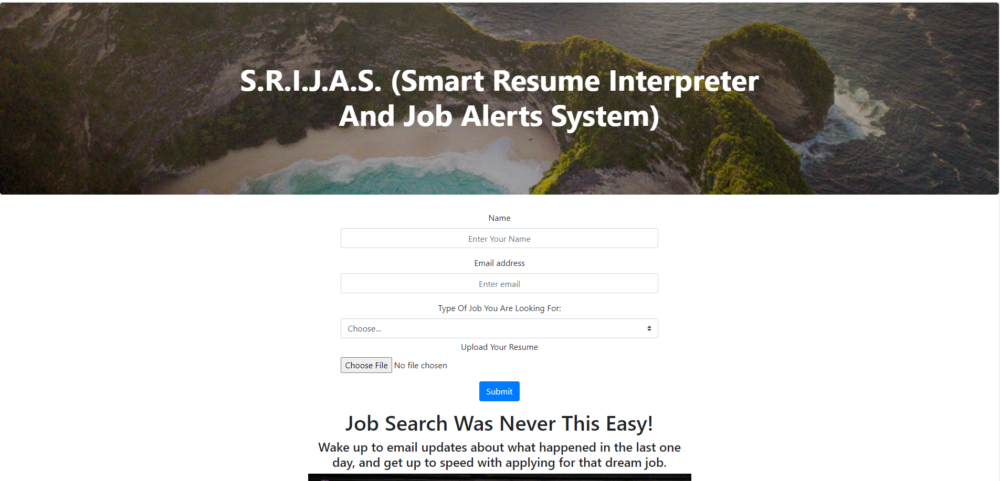
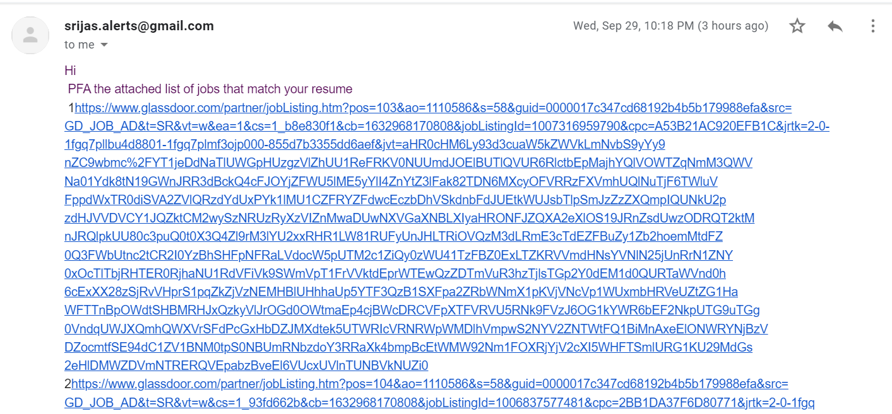

[](https://opensource.org/licenses/MIT)


[](https://zenodo.org/badge/latestdoi/408230160)
[](https://app.travis-ci.com/het-patel99/SRIJAS)
[](https://codecov.io/gh/ineelshah/SRIJAS)


https://user-images.githubusercontent.com/25223347/135366127-f6b741f2-de85-4d64-92c9-cd1d2f518090.mp4

# S.R.I.J.A.S.
## Job Search was never this easy
Smart-Resume-Interpreter-And-Job-Alert-System is an application that makes your job search easy and less frustrating.
With SRIJAS, you can upload your resume and job which you want to search for. The application will browse Linkedin and Glassdoor websites to search for the jobs.
The links of the jobs that matches with the skills in your resume, will be sent to you via email.

This is our submission for the Project for Software Engineering CSC 510 Fall 2021.


## Overview
<table border="2" bordercolorlight="#b9dcff" bordercolordark="#006fdd">

  <tr style="background: #010203 ">
    <td valign="left"> 
      <p style="color: #FF7A59"> 1.This is the main SRIJAS web page 
      </p>
      <a href="./images/home_page.png"> 
              
      </a>
    </td>
    <td valign="center"> 
      <p style="color: #FF7A59"> 2.User have to upload their resume file and enter the details
      </p>
      <a href="./images/resume_upload.png">
         
      </a>
    </td>
  </tr>
  <tr style="background: #010203;"> 
    <td colspan = "2">
      <p style="color: #FF7A59"> 3.The application matches the job postings with the skills and send email to the user.
      </p>  
      <a href="./images/email.PNG">
            
      </a>
     </td>
    </td>
  </tr>
  </table>

## Plan Of Action:

### Phase 1:
- [ ] Designing the infrastructure for hosting the web application, database and other required services.
- [ ] Taking Resume, User Email and other basic User Details from the User using a portal.
- [ ] Design Database to support all phases of development.
- [ ] Scraping data from job posting websites like LinkedIn.
- [ ] Developing an Email or Notification Service.
- [ ] Extract knowledge from scraped data.
- [ ] Match user skillsets with the skillsets extracted from scraped data.


### Phase 2:
- [ ] Take more advanced filters from the user.
- [ ] Allow users to choose the threshold of matching of Skills.
- [ ] Integrate the basic portal with a login service.
- [ ] Create a system that stores user profiles and can generate insights from it.
- [ ] Allow users to select previously uploaded resumes.
- [ ] Added UI to display user skills. 
- [ ] Added confirmation page when user submitted their details and redirects to home.php.
- [ ] Created proper structure for mail alerts that includes job information, its location, type, skills.


### Phase 3:
- [ ] Develop a dashboard.
- [ ] Summarize and generate a graph about how the user's resume has progressed.
- [ ] Allow users to generate insights from how the uploaded resume compares with job descriptions in the market.
- [ ] Generate insights from all collected data.

## Report Bug or Request a feature
<p align="center">
    <a href="https://github.com/hvudeshi/SRIJAS/issues/new/choose">Report Bug</a>
    ·
    <a href="https://github.com/hvudeshi/SRIJAS/issues/new/choose">Request Feature</a>
</p>

🔱: Installation
---
1. Clone the Github repository to a desired location on your computer. You will need [git](https://git-scm.com/) to be preinstalled on your machine. Once the repository is cloned, you will then ```cd``` into the local repository.
```
git clone https://github.com/ineelshah/SRIJAS.git
cd SRIJAS
```
2. This project uses Python 3, so make sure that [Python](https://www.python.org/downloads/) and [Pip](https://pip.pypa.io/en/stable/installation/) are preinstalled. All requirements of the project are listed in the ```requirements.txt``` file. Use pip to install all of those.
```
pip install -r requirements.txt
```

## Contributors (Phase-2)

<table>
  <tr>
    <td align="center"><a href="https://github.com/het-patel99"><br /><sub><b>Het Patel</b></sub></a></td>
    <td align="center"><a href="https://github.com/hvudeshi"><br /><sub><b>Hardik Udeshi</b></sub></a><br /></td>
    <td align="center"><a href="https://github.com/sal0ni"><br /><sub><b>Saloni Mahatma</b></sub></a><br /></td>
    <td align="center"><a href="https://github.com/kalgeekotak99"><br /><sub><b>Kalgee Kotak</b></sub></a><br /></td>
    <td align="center"><a href="https://github.com/Vineet2311"><br /><sub><b>Vineet Chheda</b></sub></a><br /></td>
  </tr>
</table>
